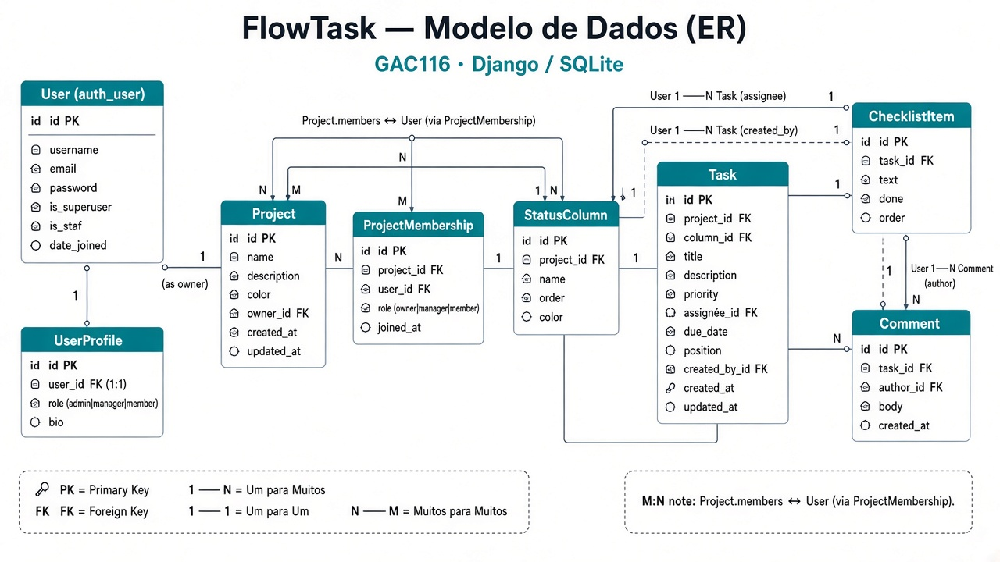

# FlowTask

Sistema gerenciador de projetos e tarefas inspirado no ClickUp, desenvolvido com **Django** para a disciplina **GAC116 — Programação Web** (UFLA).

## Integrantes do grupo

| Nome | Função no repositório |
|------|------------------------|
| Matheus Felipe Godoi Coutinho | Colaborador / mantenedor |
| Matheus Henrique Bueno Coelho | Colaborador / mantenedor |


## Descrição do projeto

O **FlowTask** é uma aplicação web completa para organização de trabalho em equipe: workspaces com projetos, quadro Kanban, lista de tarefas, prioridades, prazos, checklist e comentários. Há área do usuário final (protegida por login) e ambiente administrativo personalizado (Jazzmin), com perfis de permissão distintos (Administrador, Gerente e Colaborador).

## Tecnologias utilizadas

- Python 3.12+ / Django 5.1
- SQLite (banco relacional)
- Django Templates (DTL) — arquitetura MVT
- Bootstrap 5 (framework CSS) + design system próprio (tokens CSS)
- django-jazzmin (tema do Admin)
- JavaScript (drag-and-drop do Kanban)
- Git / GitHub

## Instruções para instalação

```powershell
git clone https://github.com/matheusfgcz/GAC116-Programacao-Web-Trabalho-1.git
cd GAC116-Programacao-Web-Trabalho-1

python -m venv venv
.\venv\Scripts\Activate.ps1

python -m pip install -r requirements.txt
python manage.py migrate
python manage.py seed_demo
```

## Instruções para execução

```powershell
python manage.py runserver
```

Acesse:

- Aplicação: [http://127.0.0.1:8000/](http://127.0.0.1:8000/)
- Admin (Jazzmin): [http://127.0.0.1:8000/admin/](http://127.0.0.1:8000/admin/)

### Contas de demonstração

| Perfil | Usuário | Senha | Acesso |
|--------|---------|-------|--------|
| Administrador | `admin` | `admin` | Site + `/admin/` |
| Gerente | `gerente` | `gerente1234` | Cria/gerencia projetos |
| Colaborador | `membro` | `membro1234` | Trabalha em tarefas |

## Principais funcionalidades

- Login, logout e cadastro (`/accounts/register/`)
- Perfis com permissões distintas (Administrador / Gerente / Colaborador)
- CRUD de projetos, colunas, tarefas, checklist e comentários
- Board Kanban com drag-and-drop
- Vista em lista com filtros
- Drawer de tarefa (fechar com ✕, Voltar ou Esc)
- Busca de projetos e tarefas
- Tema claro e tema escuro
- Interface responsiva (Bootstrap 5 + layout próprio)
- Admin personalizado com Jazzmin, busca e múltiplos filtros

## Estrutura do projeto

```
manage.py
requirements.txt
flowtask/           # settings, urls, wsgi (pacote do projeto)
accounts/           # autenticação + UserProfile
workspace/          # projetos, tarefas, board, memberships
templates/          # HTML (área do usuário)
static/             # CSS / JS
docs/               # imagens e documentos complementares do projeto
```

Branches Git exigidas: `main`, `develop`, `feature`.

## Diagrama do banco de dados

Modelo entidade-relacionamento (ER) do FlowTask, com as tabelas `User`, `UserProfile`, `Project`, `ProjectMembership`, `StatusColumn`, `Task`, `ChecklistItem` e `Comment`:



## Testes

```powershell
python manage.py test
```
